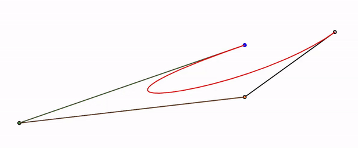

## Bézier Curves
  
  
A example showing calculation of [Bézier Curve](https://en.wikipedia.org/wiki/B%C3%A9zier_curve) of any order using [De Casteljau's algorithm](https://en.wikipedia.org/wiki/De_Casteljau%27s_algorithm) of applying recurive [linear interpolation (lerp)](https://en.wikipedia.org/wiki/Linear_interpolation) between a given set of control points. Here, a set of linearly interpolating data points is calculated between the pairs of consequetive control points. Then, those points are used as new control points to calculate another set of linearly interpolating points. This method is applied repeatedly until the point tracing the Bézier Curve is obtained. In the code here, all those intermidiate interpolating points and lines are shown to easily understand the method. Although the algorithm is computationally expensive for larger use, due to its recursive nature, it is numerically very stable and easy to understand and interpret geometrically.    

This code is inspired by the [SoME1](https://www.3blue1brown.com/blog/some1-results) winning math video ['The Beauty of Bézier Curves'](https://www.youtube.com/watch?v=aVwxzDHniEw) by Freya Holmér.

Check out this [live demo](https://koushikphy.github.io/BezierCurve/).